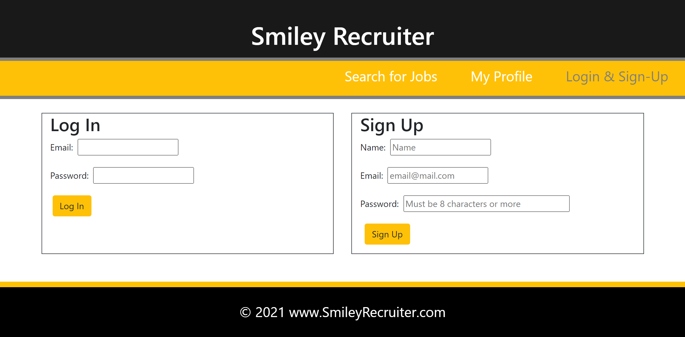
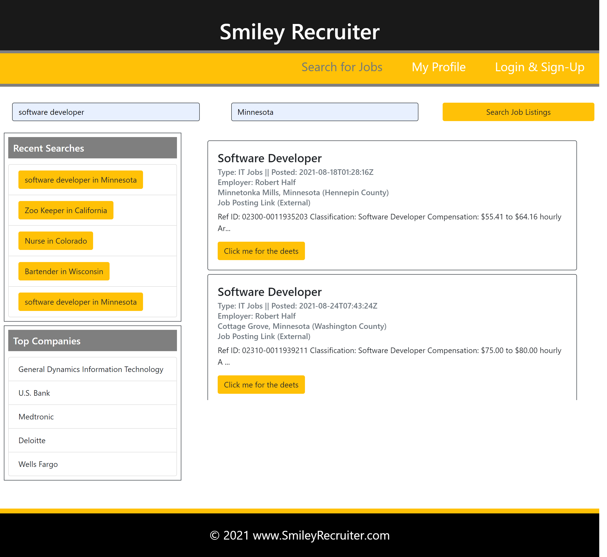
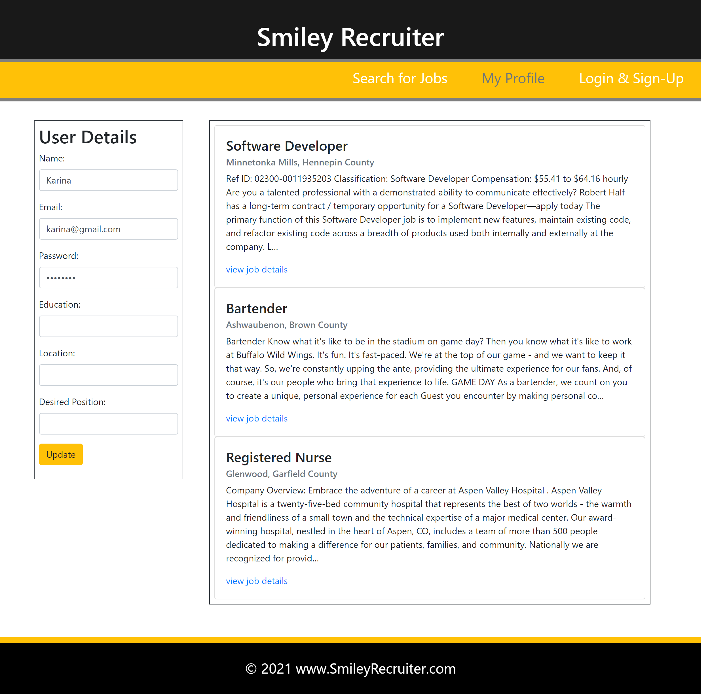

# Smiley Recruiter

[](https://opensource.org/licenses/MIT) &nbsp;&nbsp;&nbsp;&nbsp; &nbsp;&nbsp;&nbsp;&nbsp; &nbsp;&nbsp;&nbsp;&nbsp;


## :memo: Description
 Smiley Recruiter is a job search web application that allows users to look for employment opportunities nationwide based on keywords and location input. If the user creates an account, they can also save job listings to their profile. 


## :trophy: Table of Contents
* [Installation](#installation)
* [Usage](#usage)
* [License](#license)
* [Contributing](#contributing)
  
  
---
## Installation
To run locally:
* Fork the https://github.com/JChosay/group-pj3-smileyrecruiter repo.
* Clone your forked repo to VS Code on your computer.
* Open entire parent folder of the project in your terminal.
* Install the node dependencies by entering in the terminal:
```
npm i
```

* Then enter `npm run develop` to see in the browser. The application will then be listening on port 3000. Open your browser and put `localhost:3000` in the address bar of the browser page to see the application on your local device.

---
## Usage
Users can search for job postings by keywords and location. Recent searches and top employers of the entered keywords will also populate on the search page. Once logged in, job listings can be saved to a user's profile as well.

[Launch Heroku Deployed Web Application](https://safe-journey-56448.herokuapp.com/) <br />











---
## License

This project is governed by the license: MIT


---
## Contributing
>*This application was developed by:*
    <br />Mohamed Abukar
    <br />Josh Chosay
    <br />Karina Clausen
    <br />Matt Ray


The technologies that made this possible are:
* HTML
* CSS
* <a href="https://www.javascript.com/" target="_blank">JavaScript</a>
* <a href="https://nodejs.org/api/fs.html" target="_blank">Node.js</a>
* <a href="https://expressjs.com/" target="_blank">Express.js</a>
* <a href="https://www.json.org/json-en.html" target="_blank">JSON</a>
* <a href="https://getbootstrap.com/" target="_blank">Bootstrap</a>
* <a href="https://reactjs.org/" target="_blank">React</a>
* <a href="https://react-bootstrap.github.io/" target="_blank">React Bootstrap</a>
* <a href="https://www.apollographql.com/" target="_blank">Apollo</a>
* <a href="https://graphql.org/" target="_blank">GraphQL</a>
* <a href="https://www.mongodb.com/" target="_blank">MongoDB</a>
* <a href="https://mongoosejs.com/" target="_blank">Mongoose</a>
* <a href="https://www.w3schools.com/whatis/whatis_fullstack_js.asp" target="_blank">MERN Stack</a>

   Our API for this app:
   * <a href="https://developer.adzuna.com/" target="_blank">Adzuna API</a> 

  
  
  
  
 ---
## :question: Questions

For any questions, please contact us using the information below: <br />
<br />:octocat: GitHub: [@Mohamed Abukar](https://github.com/mohamedabukar)
<br />:octocat: GitHub: [@JChosay](https://github.com/JChosay)
<br />:octocat: GitHub: [@Karina5151](https://github.com/Karina5151)
<br />:octocat: GitHub: [@Matthew Ray](https://github.com/m-ray-ofSunshine)
